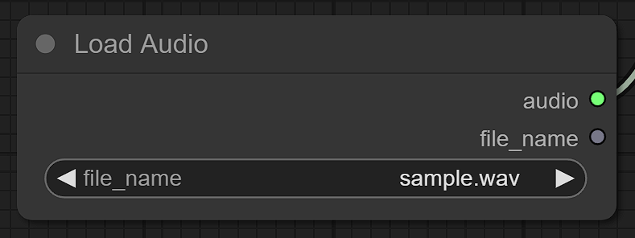
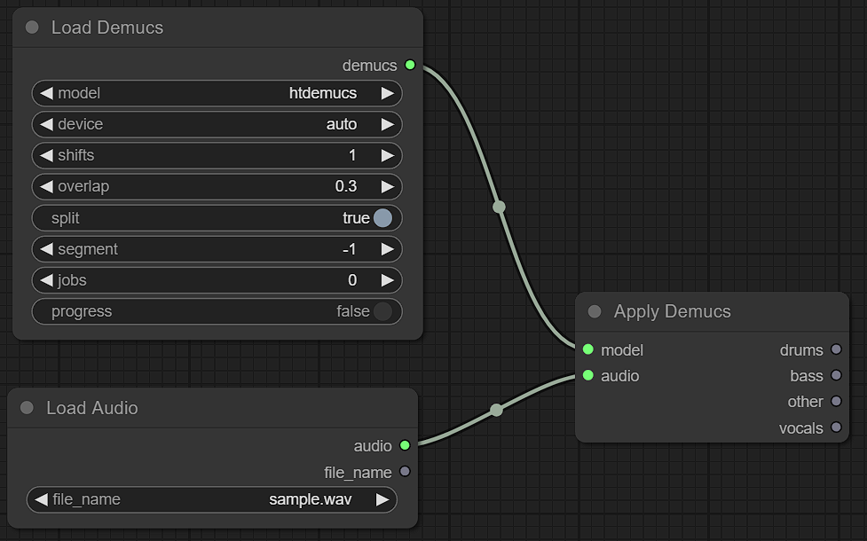
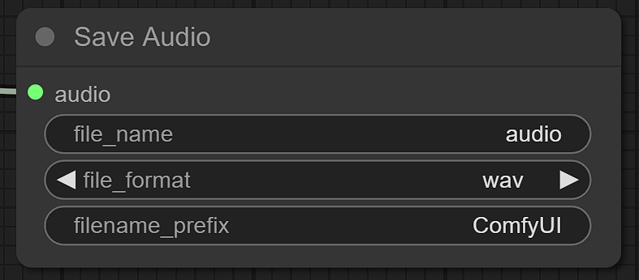

# ComfyUI-speech-dataset-toolkit

## Overview

Basic audio tools using torchaudio for ComfyUI. It is assumed to assist in the speech dataset creation for ASR, TTS, etc.

## Features

- Basic
    - Load & Save audio
- Edit
    - Cut and Trim
    - Split and Join
    - Silence
    - Resample
- Visualization
    - WaveForm
    - Specgram
    - Spectrogram
    - MelFilterBank
    - Pitch
- AI
    - [facebook Demucs](https://github.com/facebookresearch/demucs)
    - [faster-whisper](https://github.com/SYSTRAN/faster-whisper)
    - [silero-vad](https://github.com/snakers4/silero-vad)
    - [rinna nue-asr](https://github.com/rinnakk/nue-asr)
    - [ReazonSpeech nemo-asr](https://github.com/reazon-research/ReazonSpeech/tree/master/pkg/nemo-asr)
    - [SpeechMOS](https://github.com/tarepan/SpeechMOS)
    - [kotoba-whisper](https://huggingface.co/kotoba-tech/kotoba-whisper-v1.0)

## Requirement

Install torchaudio according to your environment.

```bash
cd custom_nodes
git clone https://github.com/kale4eat/ComfyUI-speech-dataset-toolkit.git
cd ComfyUI-speech-dataset-toolkit
pip3 install torchaudio --index-url https://download.pytorch.org/whl/cu121
pip3 install -r requirements.txt
```

If you use silero-vad, install onnxruntime according to your environment.
```bash
pip install onnxruntime-gpu
```

## Usage

At first startup, `audio_input` and `audio_output` folder is created. 

```
ComfyUI
├── audio_input
├── audio_output
├── custom_nodes
│   └── ComfyUI-speech-dataset-toolkit
...
```

Fisrt of all, Use a `Load Audio` node to load audio.



Please put the audio files you wish to process in a `audio_input` folder in advance.
If you've added files while the app is running, please reload the page (press F5).

`audio`, the data type of ComfyUI flow, consists of waveform and sample rate.
Many nodes of this extension handle this data.

For example, Demucs separate drums, bass, vocals and other stems. Each of them is audio data.



Finally, use a `Save Audio` node to save audio. The audio is saved to `audio_output` folder.



## Note

There are some unsettled policies, destructive changes may be made.

This repository does not contain the nodes such as numerical operations and string processing.

## Inspiration

- [ComfyUI-audio](https://github.com/eigenpunk/ComfyUI-audio)
- [ComfyUI-AudioScheduler](https://github.com/a1lazydog/ComfyUI-AudioScheduler)
